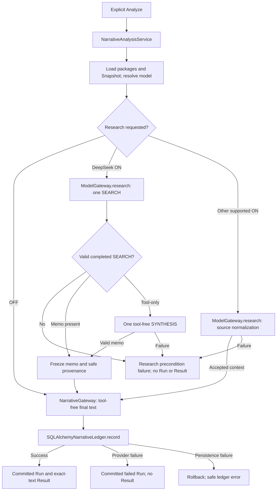

# Current Architecture

This describes authoritative baseline `722936984deac652b443eba132c69650653345e1`, whose runtime
code is accepted C2 implementation `d2d25efc79d2560a7ed09895c7dd7a2c1724aee9`. ADC-001 changes
only documentation and awaits independent review. See [ROADMAP](ROADMAP.md) for delivery status.

## 1. Product and runtime shape

AI Infra Quant is a local, single-user FastAPI modular monolith. Jinja serves the workbench;
owned JavaScript/CSS and vendored Lightweight Charts run in the browser. SQLite stores local
identity, watchlists and immutable analysis evidence. There is no production Node build service,
queue, worker fleet or remote conversation service. Read-only Futu quote access is separate from
LLM provider access. All real trading remains manual in the broker's official client. The app
never reads/imports real accounts, positions or trades, or submits orders.

Normal new Analyze is **Narrative-first**: one registered model returns final text over a frozen
current Snapshot, optionally enriched by factual research. Saving text does not certify its reasoning.

## 2. Components and dependency direction

API presentation depends on application use cases. Core domain/ports do not import FastAPI,
SQLAlchemy or provider SDKs. The composition root injects integrations and repositories.
Paths and symbols below identify the implementation, not proposed services.

| Component | Code path / symbol | Input → output | Dependency boundary |
|---|---|---|---|
| Composition/startup | [main.py](../src/ai_infra_quant/backend/main.py) `create_app`; [dependencies.py](../src/ai_infra_quant/backend/dependencies.py) `build_container` | Settings/engine/registries → injected services and routes | Selects adapters, checks migration, captures startup source revision |
| HTTP and UI | [paqs_e.py](../src/ai_infra_quant/backend/api/v1/paqs_e.py) `analyze_narrative`; [template](../src/ai_infra_quant/frontend/templates/index.html); [paqs-e.js](../src/ai_infra_quant/frontend/static/paqs-e.js) | Four-field submission → request; committed evidence → display | Same-origin API, no direct browser-to-provider call |
| Orchestration | [paqs_e_narrative.py](../src/ai_infra_quant/application/paqs_e_narrative.py) `NarrativeAnalysisService.analyze` | Security/model/strategy/research → persisted terminal outcome | Coordinates Snapshot, research, provider, ledger; no prose projection |
| Current facts | [paqs_market_snapshot_queries.py](../src/ai_infra_quant/application/paqs_market_snapshot_queries.py) `PaqsMarketSnapshotQueries`; [market_data_queries.py](../src/ai_infra_quant/application/market_data_queries.py) | Security → current immutable Snapshot | Canonical input preparation; Futu quote SDK confined to integrations |
| Model/credential policy | [paqs_e_models.py](../src/ai_infra_quant/application/paqs_e_models.py) `ModelRegistry`, `ModelCredentials` | Registered model key → descriptor/status/internal secret | Fixed catalog and shared service slots, no provider discovery |
| Secure storage | [credentials.py](../src/ai_infra_quant/core/ports/credentials.py) `CredentialStore`; [windows_credentials.py](../src/ai_infra_quant/integrations/windows_credentials.py) `WindowsCredentialStore` | Allowed slot/local input → OS credential | Current Windows user; no plaintext/database fallback |
| Research adapter | [gateway.py](../src/ai_infra_quant/integrations/openai_reasoning/gateway.py) `ModelGateway.research` | Model + Snapshot → auxiliary context or `ResearchFailure` | DeepSeek native flow or other supported source normalization |
| Final provider | [Narrative port](../src/ai_infra_quant/core/ports/paqs_e_narrative.py) `PaqsENarrativeProvider.reason_text`; [narrative.py](../src/ai_infra_quant/integrations/openai_reasoning/narrative.py) `NarrativeGateway` | Canonical request/packages → exact text or typed failure | Responses/Chat adaptation, tool-free, no legacy validator |
| Evidence repository | [Narrative repository](../src/ai_infra_quant/database/repositories/paqs_e_narrative.py) `SQLAlchemyNarrativeLedger` | Request + outcome → Run and optional Result | Short atomic write after provider, verified reads |
| Resources | [model_registry.json](../src/ai_infra_quant/resources/paqs_e/model_registry.json); [paqs_e_runtime.py](../src/ai_infra_quant/application/paqs_e_runtime.py) `load_strategy_package`; `load_narrative_prompt` in orchestration | Registered files → identified/hashed packages | [PAQS-E master](research/PAQS_E_CONTEXT_FREE_MASTER_SPEC_ZH.md) is strategy authority; no UI prompt editor |

The directory name `integrations/openai_reasoning/` is historical and now includes multiple
providers. `ModelGateway.reason` is retained structured reasoning; `ModelGateway.research` is
optional research; `NarrativeGateway.reason_text` is new final analysis. Multi-model means
selecting one registered model per attempt, not voting, parallel models, fallback or retries.

## 3. Explicit Analyze and failures

Only form submission posts `security_id`, `model_key`, `strategy_id`, `web_research` to
`POST /api/v1/paqs-e/narrative-analyses`. The service loads registered strategy/prompt, obtains
one current Snapshot, checks Security identity and resolves the model. OFF supplies empty
auxiliary context; ON must produce accepted context before the final request is constructed.
History/conversations never become hidden prompt memory.

The Research decision assumes a supported route; unsupported ON fails before dispatch.
Security/package/Snapshot errors also fail before final reasoning. Research failure never silently
becomes OFF and creates no fabricated Run/Result. A typed final-provider outcome is recorded only
after a complete request exists. This is synchronous handling, not a durable pending-job system.

The browser holds one in-flight guard. Its 180-second notice does not abort, cancel or retry.
A disconnect/unconfirmed response is an unknown outcome: the server may have committed. Read
successful history or a known Run ID before another explicit attempt. There is no failed-run
search, cancellation API or deduplication of repeated explicit analyses. See [API contracts](API_CONTRACTS.md).

## 4. Model, credential and final-text boundaries

The [model guide](PAQS_E_MODELS.md) lists the eleven registered models, fixed routes and shared
slots. Default is DeepSeek V4 Flash. Configuration/status reads report presence, not connectivity,
entitlement or balance, and make no provider call.

Users submit a secret through a local password field and same-origin JSON PUT: the secret does
pass through that input form; GET never returns it. Loopback host/peer and mutation Origin/content
checks protect the boundary. The form clears after successful save or close, with no browser
secret persistence. `ModelCredentials` prefers the OS slot; OpenAI alone can use its existing
read-only server environment fallback. Deleting the stored OpenAI key leaves that fallback intact.
Unsupported/unavailable OS storage fails safely for mutations; configured OpenAI environment
fallback can still be available. There is no plaintext/keyring fallback. Secrets are excluded
from application database/ledger, API readback and logs.

`NarrativeGateway` sends `tools=[]`, `tool_choice=none`, no JSON Schema/Object result format and
no prior conversation. It checks registered model/package identity and hashes, credentials,
transport outcome, completion/refusal, expected final content and credential echo.
[NarrativeSuccess/check_final_text](../src/ai_infra_quant/core/domain/paqs_e_narrative.py) checks
non-empty UTF-8, disallowed controls, the 100,000-character bound and safe optional response ID.
Accepted text/whitespace is preserved exactly; provider reasoning traces are discarded. JSON-shaped
prose is still text. No Entry/Setup/target/RR fields are fabricated from it and no Legacy semantic
gate certifies new success.

Evidence: [all-model final-text tests](../tests/unit/test_paqs_e_narrative_provider.py),
[registry/credential tests](../tests/unit/test_paqs_e_model_gateway.py),
[credential API tests](../tests/integration/test_paqs_e_multi_model.py). These are source references,
not ADC test-execution claims.

## 5. Optional research and provenance

Research defaults OFF on load and every model change, is not remembered or restored from history,
and never runs from refresh, credentials or selection changes. No provider retry/fallback occurs.

### DeepSeek native memo

[research_native](../src/ai_infra_quant/integrations/openai_reasoning/deepseek_research_flow.py)
sends one SEARCH with `reasoning.effort=none`. A valid completed response containing a factual
memo freezes directly. Only a valid completed tool-only response may trigger one SYNTHESIS:
original intent, accepted completed `web_search_call` items passed back as-is in order, and the
synthesis instruction. These transient items are not persisted. SYNTHESIS uses the same model,
endpoint and credential with `tools=[]`, `tool_choice=none`, `reasoning.effort=none`. Both stages
use `store=false`, `stream=false`, no `previous_response_id` or `conversation`. Invalid/refused
SEARCH never triggers synthesis.

[parse_native_search](../src/ai_infra_quant/integrations/openai_reasoning/deepseek_research.py)
requires top-level completed SEARCH and at least one completed `search`. Recognized action types
are `search`, `open_page`, `find_in_page`; statuses are `completed`, `in_progress`, `incomplete`,
`failed`, `cancelled`. Recognized partial actions are not trusted: their query/source payload is
ignored and they never enter pass-back. Unknown type/status or malformed action object fails
closed. Completed-search query/source safety checks remain. Page/find targets and prose URLs do
not become source authority.

| DeepSeek budget | Meaning |
|---|---|
| Four queries in SEARCH instruction | Advisory request, not acceptance or billing guarantee |
| 64 native calls / 128 output items / 64 raw source records | Structural acceptance bounds; source records counted before deduplication |
| Each completed-search query ≤500 characters | Non-empty, control-safe UTF-8; every exposed query validated even after capture stops |
| ≤256 queries / ≤64,000 query characters | Total structural anti-abuse bounds, not four-query rejection |
| ≤16 whole queries / ≤4,000 characters | Ordered provenance prefix; first non-fitting query stops capture |
| `provider_exposed_query_count`, `query_capture_complete` | Full valid completed-search count and truthful prefix completeness |
| Memo + provenance + label ≤24,000 characters | One frozen item; excess rejected without truncation |
| SEARCH 6,000 / SYNTHESIS 4,000 output tokens | Request budgets |
| Serialized research request/response ≤2,000,000 bytes | Transport/pass-back safety; at most two research HTTP requests |

Final Narrative is a separate call. OFF uses zero research requests; successful DeepSeek ON uses
one or two research requests plus one final Narrative. Native actions, query strings, provider
continuation rounds and application HTTP requests are distinct. Eleven actions do not fail merely
because a provider continuation-round description mentions ten.

The frozen item holds accepted final factual memo and safe provenance: model/provider, retrieval,
intent/cutoff, safe response IDs, status counts, completed action types, query prefix and optional
native sources. Aware parseable future publication URLs are excluded. Missing/unparseable times
remain unverified; memo publication timestamp is null. The explicit limitation says cutoff
compliance was requested but cannot be independently verified for every statement. Excluding a
future URL does not rewrite the memo or certify its claims.

### Other supported providers

OpenAI and Alibaba use [ModelGateway.research/normalize_research](../src/ai_infra_quant/integrations/openai_reasoning/gateway.py):
one native request and source-specific JSON summary normalization, not DeepSeek synthesis.
They retain four completed search-action/four query acceptance bounds, 64 raw source records,
up to eight included items, 1,600-character summaries, 4,000 characters per item including metadata
and 24,000 total. OpenAI sends `max_tool_calls=4`; provider execution is distinct from local
acceptance. GLM, Kimi and Hy4 research are disabled. Research summary JSON does not impose JSON
on final Narrative.

Explicit native URLs ground source metadata; the app does not fetch citation URLs. Retrieval
is not publication time. Web prices never replace Snapshot facts. Accepted `as_of_compatible`
expresses implemented filtering/request policy, not independent certification of every statement.

### Safe failure diagnostics

[ResearchDiagnostic](../src/ai_infra_quant/application/paqs_e_research.py) allows fixed
stage/class/route metadata, safe IDs/status, bounded counts and application-owned `boundary_code`.
Parser-originated [NativeParseFailure](../src/ai_infra_quant/integrations/openai_reasoning/deepseek_research_diagnostics.py)
identifies the rejecting rule. Counts distinguish per-status/completed/non-completed searches,
query/source/unknown-action and malformed/invalid observations. Unknown totals are omitted;
observations are not trusted evidence. Diagnostics are ephemeral, not ledger data. The UI shows
only validated fixed labels/codes/numbers, not provider IDs, queries, URLs, memo, raw JSON,
exceptions, credentials or reasoning. Secret-tainted bodies are not reparsed for details.

Evidence: [continuation tests](../tests/unit/test_paqs_e_research_continuation.py),
[multiplicity tests](../tests/unit/test_paqs_e_search_multiplicity.py),
[partial-action tests](../tests/unit/test_paqs_e_partial_actions.py),
[lifecycle API tests](../tests/integration/test_paqs_e_partial_actions_api.py).
The 16-call / 7-search / 24-query tool-only fixture passes only completed items to one synthesis;
tests also cover direct memo, invalid envelopes and zero completed searches.

## 6. Persistence, lineage and time

`SQLAlchemyNarrativeLedger.record` opens its write transaction after final reasoning. No long
write transaction covers research/provider calls. It reuses immutable runtime artifacts and
atomically writes a terminal `SUCCEEDED` Run and one Result, or `PROVIDER_FAILED` Run without a
Result. Persistence failure rolls back. SQLite uses `BEGIN IMMEDIATE` for revision allocation.
Revisions are per `(security_id, strategy_id)` across model/hash changes, independent of Legacy
series. Reads verify canonical request/text hashes, parent identity, artifacts and lineage.

The request freezes Snapshot, model/provider, strategy/prompt hashes/versions, runtime config,
research flag and auxiliary context. Run start/completion surround final reasoning; research
precedes `started_at` and has its own retrieval timestamp. UTC instants and local sessions remain
distinct. Decimal facts remain exact canonical strings; chart number conversion is drawing only.
Head is `0003_task007c1_narrative_ledger`; 0001/0002 are retained. See [DATABASE_SCHEMA](DATABASE_SCHEMA.md).

This ledger is not a generic market archive. Current provider read-through/QFQ and frozen
W1/D1/M30 evidence do not provide arbitrary strict historical As-Of replay. Hashes prove stored
content/identity, not profitability or machine-certified strategy, target or RR validity.

## 7. UI and Legacy compatibility

The workbench retains active watchlist management, current charts, explicit controls, Narrative
history, known Run reads and frozen charts. C2 removed opening-capital/NAV cards, duplicate admin
and dedicated frontend requests; foundation data and compatibility APIs remain. Credentials use
a responsive single-column dialog with separate actions and bounded scrolling.

[narrative-markdown.js](../src/ai_infra_quant/frontend/static/narrative-markdown.js) creates local
DOM/text nodes for a safe Markdown subset; HTML, links and images remain inert. Default formatted
and exact raw-text views share the persisted text/hash. No remote renderer or unsafe HTML sink is
used. Refresh cannot mutate selected frozen evidence; Narrative prose creates no price overlays.
See [workbench guide](PAQS_E_WORKBENCH.md) and [Markdown tests](../tests/browser/test_paqs_e_safe_markdown.py).

Legacy structured Runs/Decisions, deterministic validator and GET APIs remain historical evidence.
Old POST `/api/v1/paqs-e/analyses` is hidden from OpenAPI and normally returns 410.
`create_app(legacy_analysis_enabled=True)` is an internal regression switch, not a user setting,
environment option or UI control. Structured displays/overlays are confined to Legacy records.
No conversion rewrites old records or fabricates structured fields from prose.

## 8. Implemented, retained and deferred

| State | Scope |
|---|---|
| Current user capabilities | Market/watchlist workbench, current Snapshot, selected-model Narrative, secure credentials, explicit research, immutable evidence/history |
| Retained non-default | Legacy structured runtime/validator/ledger; original deterministic 006B with `STRUCTURE_CONCERNS_FOUND`; Phase 1 opening accounting/descriptors and compatibility reads |
| Deferred | 006B1 market archive/replay and planned 0004; strict historical As-Of/GoldSet; PAQS-Q successors; 007D comparison; Paper Broker/PaperFill/NAV/performance and Phase 3/4 extensions |
| Permanently excluded | Real-account observation/import/positions, broker writes/orders, autonomous execution |

006B1 stays on hold until ADC independent review/integration and a new exact-baseline handoff.
Skeletons and route names do not activate deferred behavior.

## 9. Historical evolution and evidence

These records describe original checkpoints and remain unchanged. Current behavior above does
not require reading successive remediation overrides.

| Increment | Contribution / historical evidence |
|---|---|
| 007A/B/C | Structured runtime → Decision Ledger → workbench; [007B review](reviews/TASK_007B_INDEPENDENT_REVIEW.md), [007C review](reviews/TASK_007C_INDEPENDENT_REVIEW.md) |
| C1 | Models/credentials/research; [contract](../prompts/tasks/TASK-007C1_PAQS_E_MULTI_MODEL_SECURE_CREDENTIALS_WEB_RESEARCH.md), [report](TASK_007C1_IMPLEMENTATION_REPORT.md) |
| R01 | Compatibility/handshake/long wait/Legacy projection; [contract](../prompts/tasks/TASK-007C1_REMEDIATION_01_LIVE_DOGFOOD_RUNTIME_COMPATIBILITY.md), [report](TASK_007C1_REMEDIATION_01_IMPLEMENTATION_REPORT.md) |
| R02 | Narrative and 0003; [contract](../prompts/tasks/TASK-007C1_REMEDIATION_02_NARRATIVE_FIRST_REASONING.md), [report](TASK_007C1_REMEDIATION_02_IMPLEMENTATION_REPORT.md) |
| R03 | Memo/Markdown/opt-in; [contract](../prompts/tasks/TASK-007C1_REMEDIATION_03_NATIVE_RESEARCH_MEMO_SAFE_MARKDOWN.md), [report](TASK_007C1_REMEDIATION_03_IMPLEMENTATION_REPORT.md) |
| R04 | Conditional synthesis; [contract](../prompts/tasks/TASK-007C1_REMEDIATION_04_DEEPSEEK_WEB_SEARCH_CONTINUATION_MEMO_SYNTHESIS.md), [report](TASK_007C1_REMEDIATION_04_IMPLEMENTATION_REPORT.md) |
| R05 | Multiplicity/capture; [contract](../prompts/tasks/TASK-007C1_REMEDIATION_05_DEEPSEEK_SEARCH_MULTIPLICITY_COMPATIBILITY.md), [report](TASK_007C1_REMEDIATION_05_IMPLEMENTATION_REPORT.md) |
| R06 | Partial actions/diagnostics; [contract](../prompts/tasks/TASK-007C1_REMEDIATION_06_DEEPSEEK_PARTIAL_ACTION_COMPATIBILITY_EXACT_DIAGNOSTICS.md), [report](TASK_007C1_REMEDIATION_06_IMPLEMENTATION_REPORT.md), [review](reviews/TASK_007C1_REMEDIATION_06_INDEPENDENT_REVIEW.md) |
| C1 closeout | [User acceptance](decisions/TASK_007C1_CLOSEOUT_2026_09_08.md), not independent recomputation of local hashes or all-model paid testing |
| C2 closeout | [Review](reviews/TASK_007C2_INDEPENDENT_REVIEW.md), [user closeout](decisions/TASK_007C2_CLOSEOUT_AND_006B1_HANDOFF_2026_09_08.md); user screenshot showed C1 branch without SHA, not verified exact-C2 runtime |
| ADC sequencing | [Decision](decisions/ARCHITECTURE_DOCUMENTATION_CONSOLIDATION_BEFORE_006B1_2026_09_09.md), [report](reports/TASK_ADC_001_IMPLEMENTATION_REPORT.md); docs-only, pending independent review |
